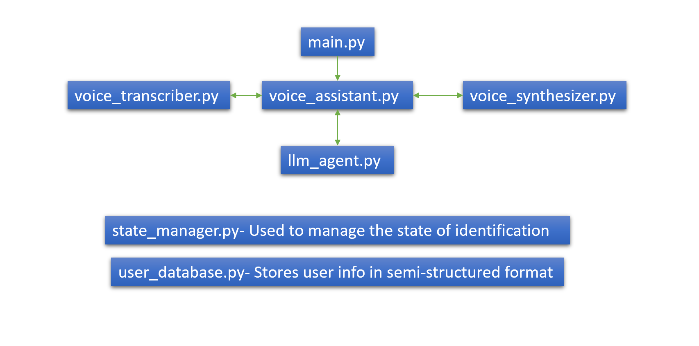

# 🗣️ Voice Assistant for Customer Service

A real-time voice-based assistant that transcribes user speech, extracts identity information using LLM, verifies it against a database, and responds with synthesized audio using Deepgram APIs.

---

## 📌 Features

- 🎤 **Live Speech-to-Text** via Deepgram's `listen` WebSocket
- 🧠 **LLM-based Identity Extraction** using Groq's LLaMA 3
- 🗂️ **User Verification** via custom user database
- 🔊 **Text-to-Speech Response** with Deepgram's `speak` API
- 📡 **Session Management** to track conversation state
- ⏸️ **Microphone Control** for cleaner user interaction

---

## 🏗️ Architecture



---

## 🚀 Getting Started

### 1. Clone the repository
```bash
git clone https://github.com/your-username/voice-assistant
cd voice-assistant
